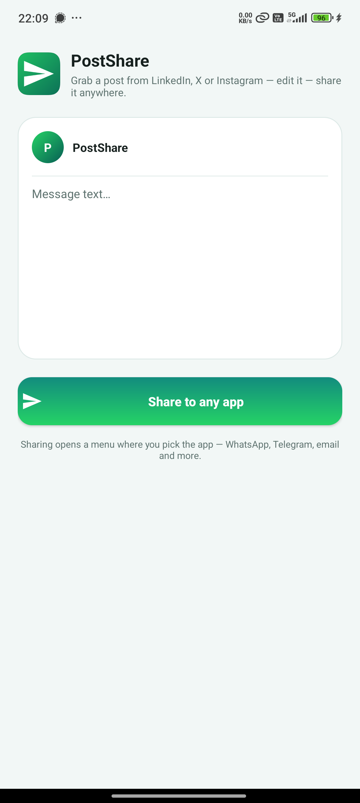
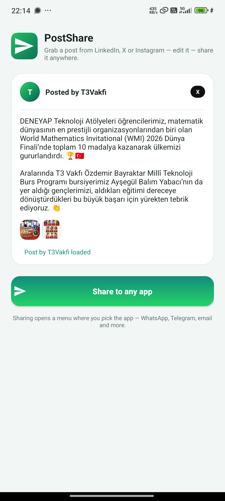
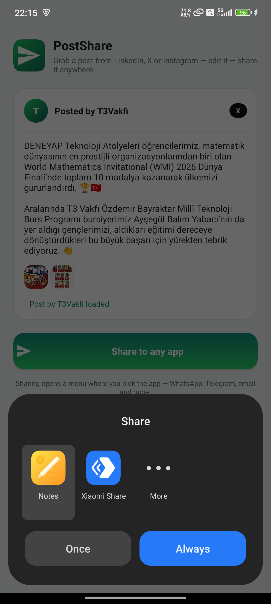

# PostShare

Share social media posts to any app.

Grab a post from **LinkedIn**, **X (Twitter)**, or **Instagram** — review and edit the text and images — then send it to **WhatsApp, Telegram, email, or any other app** via the Android share sheet.


## Why?

LinkedIn and X don't let you forward a post's actual text and images to a chat — they only share a link. PostShare reads the shared link, fetches the full post content (text + images) automatically, and lets you send it anywhere.

## Features

- **One-tap capture** — share a post link to PostShare and it fetches the content automatically
- **Auto-fetch per platform**:
  - **LinkedIn** — full post text, author, and images
  - **X / Twitter** — full tweet text, author, and images
  - **Instagram** — full caption and image
  - **Facebook** — passes the link as text (content is login-locked)
- **Share to any app** — WhatsApp, Telegram, Messenger, email, and more
- **Image support** — single or multiple images with tap-to-preview
- **Polish** — post-preview card UI with author, platform badge, and status feedback

## Screenshots

| Empty state | Post fetched | Share sheet |
|:---:|:---:|:---:|
|  |  |  |

## How it works

1. From LinkedIn / X / Instagram, tap **Share** and choose **PostShare**.
2. PostShare detects the platform and fetches the post's text and images.
3. Review or edit the message in the preview card.
4. Tap **Share to any app** and pick where to send it — text and images go together.

### Platform notes

| Platform | Text | Images |
|:---|:---:|:---:|
| LinkedIn | ✅ | ✅ |
| X / Twitter | ✅ | ✅ |
| Instagram | ✅ caption | ✅ |
| Facebook | link only | — |

> Instagram captions and Facebook posts are fetched through public, login-free endpoints. Instagram requires the `Googlebot` user-agent to return the static caption.

## Building

The project is native Kotlin (no Android Studio needed).

```bash
# One-command build — downloads JDK 17, Android SDK, and Gradle into .tools/
./scripts/build.sh

# APK output
app/build/outputs/apk/debug/app-debug.apk
```

Or use the Gradle wrapper with a local Android SDK:

```bash
export ANDROID_HOME=/path/to/android-sdk
./gradlew assembleDebug
```

- **minSdk** 24 · **targetSdk** 34 · Kotlin 1.9 · Java 17
- Icons are generated from `scripts/gen_icons.py` (pure-Python PNG writer)

## Project structure

```
app/src/main/java/com/postshare/app/MainActivity.kt   # all logic: fetch, parse, share
app/src/main/res/layout/activity_main.xml            # post-preview card UI
app/src/main/AndroidManifest.xml                     # share receive + launcher
scripts/build.sh                                     # offline toolchain bootstrap
scripts/gen_icons.py                                 # launcher icon generator
```
